```
本文约5300字，是我对VC维的学习笔记，也有一些自己的理解。
初学者或进阶者读完大约需要20min时间，相信会对你有帮助的。
非常渴望读者能指出文中不妥的地方，非常欢迎评论留言 :)

主要参考台大的课程，会以最简洁的逻辑介绍VC维的概念。
实际上还有很多细节和另外的知识点，需要阅读下面四份参考资料，
还有第4个参考资料的参考资料。

参考资料：
《机器学习基石&技法》台湾大学林轩田 （本文截图均出自本课程讲义）
《统计学习基础》李航
《机器学习》周志华
《VC维的来龙去脉》腾讯vincentyao
```

## 1. 从MNIST说起
784维空间，每个点取连续值[0,1]，对应10个类别。然后训练好一个模型，输入新的图片预测其类别，居然能以99%以上的概率返回正确值。几百维的空间，还连续取值，要找到一个使其对应10个标量点的映射。关键是新输入的图片可以很夸张的变化，结果也能大概率分类正确。这期间到底发生了什么？

1. 最终在假设空间找到的这个映射，输入空间和输出空间如此不对等，还那么robust，我们自然想到其中有很多简并可以描述了。一个系统有大量简并，暗示着还有其它可观测量和哈密顿量对易。只要找到它们，就能描述清楚简并，能描述清楚自然就能做更多的事情，比如快速判断一个状态的性质。回到MNIST来，意思就是如果能找到一些合适的“可观测量”然后基于这些“可观测量”的结果，可能能快速判断一个输入图片的类别。比如，对手写数字“6”，定义“观测A(操作A)：把图片水平翻转/垂直翻转/旋转/平移/加白噪声/形态学操作(腐蚀/膨胀/开/闭等)... 或是它们的组合。这也其实就是对手写数字“6”的描述，也是对手写数字“6”的一次观测，看看进行某种操作后图片是否保持不变，我们是希望进行某种操作后图片对我们来说还是表示“6”。当然可以继续改进观测A(操作A)使其在测试集上表现很好。我们不妨想一想，一副图片，何以是“6”这个概念，就算写的大一些小一些歪一些扭一些它都是“6”，但是如果越过界限那它就不是“6”了，这种变换下的不变性是否才是“6”这个概念最准确的描述？如果能用一些操作规则(不论是显式还是隐式)来描述这种“如果越过界限那它就不是“6””的界限，那就成了。打两个比方：a.如果对一个输入图片进行小幅度平移镜像旋转它还是“6”，对它加白噪声加某些形态学变换它还是“6”，对它旋转180度它就恰好变成输出空间另一个类，对它搜索图片中是否含有闭合或接近闭合的孔状结构得到肯定的答案之后再把这个孔替换成正圆它还是“6”，...以上组合操作它还是“6”，那么这些操作/观测就对应“6”这个概念。b.如果有一只猫能修炼成精变成人形，她长得像人，动作像人，会说话会思考，会生长会死，没有特异能力，生物检测也和人一样...那么她就是人。我们能想到测量(操作)应该是一种不那么局域的描述，所以才对小区域像素点抖动不敏感；还应该是基于统计的，才能抵抗各种噪声。

2. 即使是随机生成28\*28像素的黑白图片，这个输入空间也比宇宙原子总数还多，我看是要等到太阳熄灭也找不到几张有手写数字的图片吧。(黑白图，2^(28\*28)>>10^80，灰度图会更大一点，imgnet就更大了 ) 想象一个784维的空间分布着的数据集，我们想到了聚类，也想到一个问题“在全空间中手写数字所占的比例是多少”，也想到了此数据集在全空间的形式可能是某种特定的曲面。总之，即使不做实验也能很确信：手写数字是很特殊的，数量是极少的，而且紧密相连，甚至有明确的空间结构。

3. 我们当然可以说服自己“我们的模型找到了这个流形结构/聚类点结构”，如果假定新的输入会落在该高阶抽象的概念聚类点/流行上，那么自然就又准确又robust了。
> (补充一点，这句后半段是流形学习的假设，但我觉得嘛，谁说两个输入同属一个高阶抽象概念那么它们的 raw data 就一定距离很近呢，而且该高阶抽象概念的所有样本 raw data 还恰好形成一个低维结构？从渐变微扰来想自然是没问题，但如果是要分辨出不同视角不同环境不同姿势下的某种鸟呢，这个情况样本之间的差异可是极大的。不过还好人眼的识别天然就是局域性质(认出30年不见的老友，认出不同体态的同一种鸟，这些估计就不仅仅是局域性质的事情了)。否则岂不可以通过定义不同数字的图片(比如对外星人来说一个特殊的白噪声就是它们的数字)，使得手写数字的所有输入均匀分散在全空间，那就得靠非局域模型或复杂的核技巧变到局域流行情况再来处理了。)

4. 我们当然也可以说服自己，“我们的CNN找到了从低到高几个层次下的最优特征，新的输入不管怎么变都逃不出这些特征的手掌心，都会逐层激活相应节点然后输出预测值”。嗯，而且逐层激活的线路应该也是大致10个类别。

5. 但是为什么一套迭代函数 s(w4\*h(w3\*g(w2\*f(w1\*x1 + b1) + b2) + b3) + b4)就能保证找到那个很好的映射呢？毕竟输入空间很大，而样本才5w个。还有哦，为什么这个迭代函数就有能力描述那个映射呢？这个函数空间更大，无穷维，又是如何保证一定能快速找到最好的映射呢？ 这些问题放到任何模型上都值得一问。( 有谁知道怎么用lisp写这个表达式吗，我用mathmatica和python试了30min还是没成 : (    )

## 2. 机器学习的流程是什么样子的？
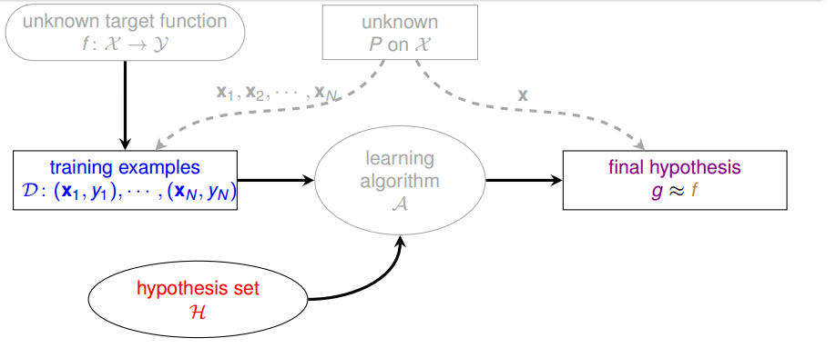

X是输入空间。f(X-->y)是我们假想存在的一个(或多个)映射，它把每一个图片完全准确地映射为相应的数字标签。TrainDataSet是怎么来的呢，是它是先在X空间以分布P抽样出来的，这个P我们也不知道。我们要做的事情是：利用TrainDataSet找到 f，使其对新抽样出来的x有很好的预测值。

**模型**：假设空间。我们也不知道f是什么，所以干脆瞎猜，把一大把各种千奇百怪的映射放到一个集合里面去，这个集合就是假设空间H。

**策略**：现在有了数据，有了假设空间，我们需要某种策略来从假设空间中分辨出那个好的假设出来。怎么分辨呢？这就是策略，也就是损失函数。

**算法**：实现上一句的具体步骤。


## 3. PAC and VC dimension
本小结所讨论的情况，输入空间可以离散或连续，样本量充足，输出空间是两个标量点。
### `3.1 Hoeffding不等式，PAC`
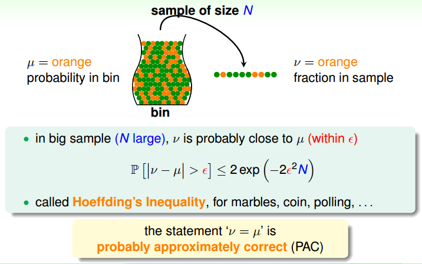

这个我们是都会同意的，大一概率课嘛。想不想看看如何从这点出发给予机器学习(包括深度学习)坚实的数学基础？这是配得上得一个图灵奖的成就哦。


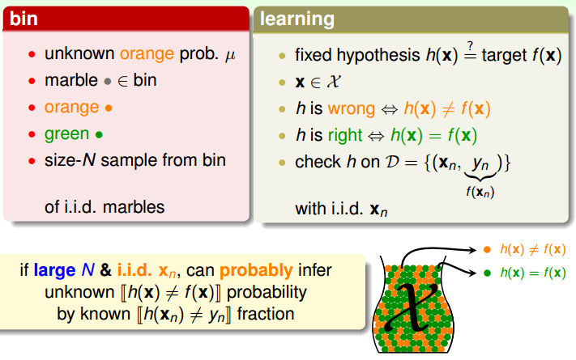

那么如果把弹珠换成样本。然后我们想寻找到一个最好的h。怎样才是最好的h呢？我们可以把罐子的弹珠全部染色，如果h(x)=f(x)就染成绿色，否则橙色。我们不知道h(x)和f(x)的解析式是否相等或者是否很接近，但我们知道罐子里的样本有多少h(xi)=f(xi)。如果对于某个假设h，罐子里面大部分都被染成绿色，那我们就说这个假设很可能就是很接近f的。

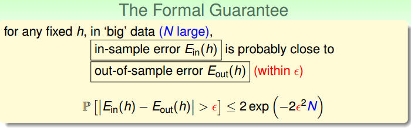

**PAC给出一个抽象刻画机器学习能力的框架。**

只要罐子里的弹珠数量够多，就能以很大的概率认为罐子里面的误差 E_in(h) = sum( I(h(xi)==f(xi)) ) 和罐子外面(测试集，新的样本)的误差 E_out 很接近。I(True)=0, I(False)=1.

> * 如果恰好E_in还很小，那么这个h就是我们要选定的假设。但是一般不会这么巧恰好E_in很小，总之，Hoeffding不等式保证了E_in约等于E_out。
> * 我们想要的肯定是E_out很小嘛，这样的假设对于罐子外面的样本也有很好的预测。但是怎么得到E_out很小呢？en... 固定一个假设h，确实不妥，不如我们考虑很多很多假设吧，说不定总有一个假设能满足要求。
> * 之后怎么从很多很多假设里面选出最好的假设(E_out很小)呢？因为我们也不知道罐子外面的样本(预测就是目的，如果知道测试集那就不用玩了，根本不用预测。f和P都是未知的)。我们只知道训练集(罐子里面的样本)，那就选一个最小的E_in吧。
> * en...  没有什么问题吗？

### `3.2 矩阵视角`
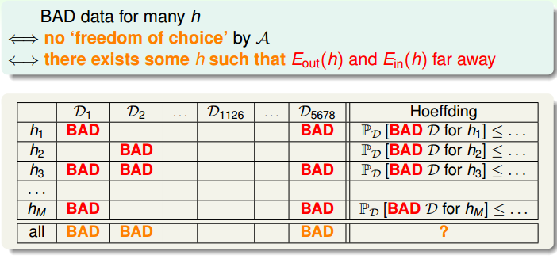

我们现在考虑很多假设空间中所有的假设，对应图中的列。
考虑从输入空间以分布P抽取样本数量为N的训练集D1，D2，D3 ... D5678 ... (可以是无穷个)

对于任何一个h，任何一个训练集，发生坏事的概率最大为 2 * exp(-2 * eps * eps * N).如果锁定h，对于该行，发生坏事的最大概率是多少呢？

key： 2 * exp(-2 * eps * eps * N)


因为定义本来就是说“如果抽样N个样本，有 2 * exp(-2 * eps * eps * N) 的概率abs(E_in-E_out)>eps”。

每一行都对应样本量为N的所有可能的训练集，发生坏事的可能性 < 每一个抽取到训练集Di的概率*这个训练集Di是发生坏事的概率。仔细想想是不是这个理。由此，每一行的bounding的出来了。
> 到底发生了什么事情，每一个格子发生坏事的概率是 2 * exp(-2 * eps * eps * N)，为什么同一行的格子累加后总体发生坏事的概率仍然还是 2 * exp(-2 * eps * eps * N)？？？
> 
> 因为前面有句话有问题。“对于任何一个h，任何一个训练集，发生坏事的概率最大为 2 * exp(-2 * eps * eps * N)”，“每一个格子发生坏事的概率是 2 * exp(-2 * eps * eps * N)”。这两句话都不严谨。要明白啊，如果固定了假设和数据集，那么这个格子发生坏事发生好事没有什么概率，只有发生或不发生。
> 
> 样本量为N的数据集我已经全部抽取出来了(就算无限也没事儿)，每一个格子是好还是坏已经固定了，每一行发生坏事的格子所占比例就是小于 2 * exp(-2 * eps * eps * N)的。


如果假设空间有M个假设，那么，总共发生坏事的概率 <  2 * M * exp(-2 * eps * eps * N)

**我们可以得出结论**：有限的假设空间情况，可以通过采集很多的样本点，来确保对假设空间每一个假设使得其P( abs(E_in-E_out) > eps ) <  2 * M * exp(-2 * eps * eps * N)。

也就是说我们现在做的事情是在保证，保证即使有多个假设存在，每一个假设的 E_in 都可以约等于 E_out。然后我们就可以放心的用合适的策略和算法快速选择出一个最好的假设h了。因为已经有理论保证了，所以这个选出来的假设h一定在测试集上表现得和训练集一样好。

（
其实不是一定，只是以很大概率保证而已。其实也不是能表现得和训练集一样好，实际上可以证明模型在测试集上平均表现比训练集上要差一点点，这点在课程里有简略证明的。

**那，如果假设空间无穷维呢？**

无穷维的假设空间很常见，比如假设空间H:{二维空间所有的直线}
 ）


> * 本小节和上一小节有什么区别？
> 
>上一节是针对单个假设h，只要抽样数量够大，根据Hoeffding不等式就能把坏事的概率压缩到 2 * exp(-2 * eps * eps * N)。
所谓好事，指的是假设h在罐子(训练集)里面的表现和罐子外面(测试集)的表现要一致，也就是abs(E_in - E_out) < eps。
所谓坏事，指的是假设h在罐子里面的表现很好但在罐子外面表现不好，也就是abs(E_in - E_out) > eps。
> * 考虑单个假设和考虑假设空间所有的假设有什么不一样吗，值得大写特写？
> 
>有不一样。
同样的一个训练集，我可以构造出一个特别设计的假设ss让它在训练集上表现完美。但是不一定能在测试集新的数据上也一样好。其实已经写在上面计算矩阵整个 bounding 里面了，针对一个特定的假设，每一行的bounding都不大，只要保证采样量够大每一行发生坏事的概率就很小。但是如果有很多列，那么总体发生坏事的概率就会变大。这是纯粹的数学，要相信。用白话文说就是“如果假设空间过于庞大那么就很可能找到不好的假设，其在罐子里面表现很好但在罐子外面表现不好”。
> * 那又为什么抽取样本量为N的所有可能的集合？
> 
>为了让结论无关于哪一个具体的数据集啊，用穷举来抽象，抽象出训练集的个数N来，滤除具体训练集的依赖关系。


放图，我们真正想要的是证明在假设空间无穷维的情况下有没有一个常数m_H可以替换假设空间有限维的M。**如果真的有一个m_H能代替M就好了！**

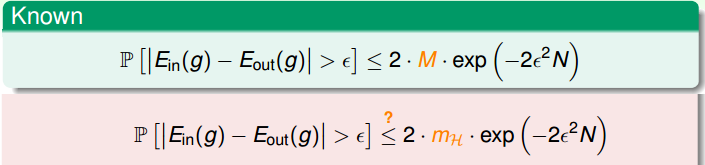


### `3.3 几个定义`
**dichotomy**: 某个假设h对样本集(N个点)的预测，一个标量列表。该列表属于{0, 1}^N

**dichotomies**: 假设空间中每一个假设对该样本集的预测，多个标量列表。注意，如果有两个假设h1，h2的预测标量列表是一样的，那只计算一次，是集合结构没有重复哦。

**m_H(N)**: 任意选N个样本，假设空间 `H` 在 N 个样本上所能具有的`dichotomies`的最大数量。

**growth function**:  `m_H(N)`对N的增长曲线。大多数情况肯定随N变大而变大，关键是增长的速度。

**shatter**: 当存在某个抽样样本集(N个点)，对于假设空间 `H` 来说，`m_H(N)`=2^N，那么就称"这个样本集可以被 `H` `shatter`"

**break point**: 当不存在这么一个样本集(k个点)可以被 `H` `shatter`，那么就称"k是 `H` 的`break point`"。（若无特殊说明，我们说的k一般是指最小breakpoint）

**bounding function**: 当存在`break point`时，`m_H(N)`的最大可能值，称作`bounding function B(N,K)`.

> 这几个定义是逐步渐进的，定义最重要了，任何时候有不明白的地方首先应该想的就是定义，思考定义，理解定义。我在看完课程，写完笔记，之后，也需要时常回想一下定义的。


如果真的看明白了以上几个定义，知道定义的依赖关系，甚至知道为什么要这么定义(这个末尾会讲)，就可以往下继续推演，无需借助图像或者范例。所以接下来两小节的内容可能更适合已经明白VC维的同学，来做一次思维体操吧 :)

嗯，我知道抄一堆定义，然后自顾推演，就像故意省略思考过程故意不给代码写注释一样，很讨厌的。明明本人就是借助图像借助范例还用了几张草稿才明白的。所以末尾会有对“为什么要这么定义”的思考。下面两小节我会写出推演过程，其实我是希望第一次听说VC维的同学也能看明白，我尽量把推演过程写清楚而且用词尽量直接粘贴复制定义。加油试试哦！

---
### `3.4 填一张抽象的表格`
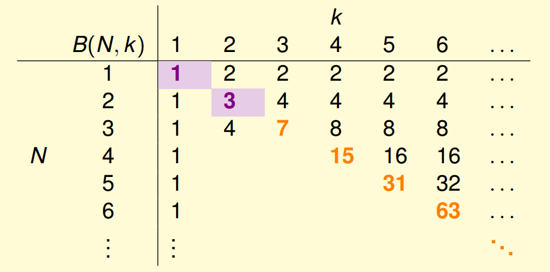

* 
1. 如果 k = 1，B(N,1)等于啥？
2. 也就是在问 `m_H(N)`的最大可能值 等于啥？
3. `m_H(N)`：假设空间 `H` 在 N 个样本上所能具有的**dichotomies**的最大数量
4. 哦，原来是要算**dichotomies**最大数量啊。。
5. 既然 k = 1，对于样本量为N的训练集，如果假设空间已经有了一个**dichotomy**，那么就不可能再有第二个**dichotomy**了，否则肯定会有存在一个样本集(1个点)可以被 `H` `shatter`。

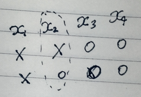

第一个**dichotomy**是"xxoo", 第二个**dichotomy**当然可以随便填，但是不能和第一个一样，**dichotomies**是集合。但只要不一样了，我就可以选择出一个训练集(样本量为k=1)使得这个训练集可以被 `H` `shatter`，违反了 k = 1 的条件。所以 B(N,1) = 1


* 
>
1. B(3,2)等于啥？
2. 我们知道是咋回事这次就不一一copy定义了。
3. 如下图，对于N=3，**dichotomies**的数量最多是8，但是如果按左侧填完四条**dichotomy**后我们发现无论虚线框里的第5条怎么填，都会违反k=2的定义。所以B(3,2)=4

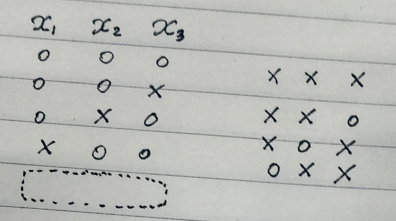


* 
>
1. N<=k, B(N,k)等于啥？
2. 略。


* 
>
1. 图片空余的B(N,k)等于啥？

再接着推一下B(4,2)，B(4,3)，B(5,2)，B(5,3)，B(5,4)

在推的过程中，以及结果的巧合性，可以总结出递推公式。

最后可以证明 B(N,k) <= sum( C(N,i), {i,1,k-1} ), C是组合数符号。


## `3.5 VC dimension`
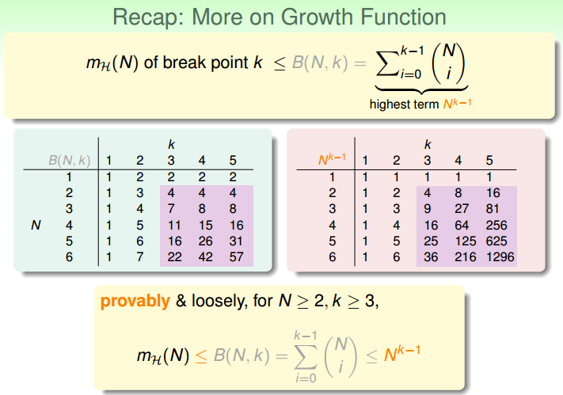

**定义**：**对于假设空间H，其VC维是指，能使得m_H(N)=2^N的最大的样本量N，也就是能被 H shatter 的最大样本集中的的样本数量**。

根据定义，dvc = k-1。

换元，

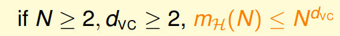

现在即使是无限维假设空间也办妥了，而且无关乎 f，P，H，A (见第一张图)。


## 4. 蓝月亮的补充说明

再看一看我们的逻辑链，
* 我们在`3.2矩阵视角`末尾说，“如果真的有一个m_H能代替M就好了”
* 然后我们定义m_H(N)。注意，此前我们不知道要把m_H的值和N扯上关系。
* 然后我们花大篇幅在`3.3几个定义`、`3.4填一张抽象的表格`、`3.5VC dimension`里，找到m_H(N)的bounding。
* 然后定义dvc

* 真的没什么问题吗？

.

.

.

.

.

.

哈！留着坑呢！

逻辑上只说了“如果真的有一个m_H能代替M就好”，然后定义m_H(N), 给出其bounding，**但是一直没说“为什么对于无限维假设空间可以用一个m_H来起到和有限维假设空间一样的效果”啊**。

我故意在之前不说清楚的，故意照着ppt讲的！

其实ppt里也没讲，印象中视频课里老师也没讲。不过以上结论的确没有错误。如果弄明白这个逻辑链缺失的环节会对理解`几个定义`小节有很大帮助。

关键点还是在于`矩阵视角`四个字。行无需赘言，我们来讨论列吧。

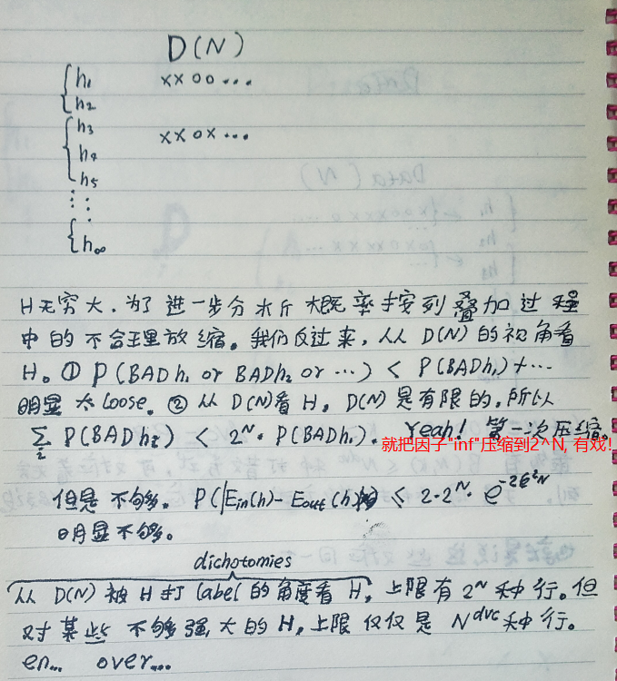

那么是不是H越强大越好呢？

当然不是。我们的目的是找到那个未知的f，如果运气好，很简单的一个H就能覆盖(或接近)f了，甚至一个维度为1的H干脆直接猜中f了。如果假设空间H过强，确实更有可能包含距离f很接近的假设，但是这会发生一件事情：
>因为我们挑选一个假设的时候是用某种策略从训练集来观察h的反应的，如果H过强，不论我们花多大精力准备如何如何多的训练样本，比如准备N=10^(10^(10^(10^10)))样本量的训练集，这个H却强到，强到可以描述(或者说可以**shatter**)训练集的输出空间的每一种情况，那样肯定能选出在训练集完美表现得假设h。但这有啥用呢！我是说**本来是要你猜f的，现在倒好，你欺负我的观测手段(或者说挑选手段)只能依赖训练集**，而训练集无论有限还是无限都小于输入空间，于是你干脆偷懒不去花精力猜f，反而让化力气H肯定能在任意数量的训练集上完美表现，这就偏离初衷了。初衷是什么？初衷是预测(输入空间-训练集)啊。哼！幸好我们有概率论，可以知道像你瞎猜(尽管猜无穷次)，发生坏事的概率是 <= 2 * 2^N * exp(-2 * eps * eps * N)。

事情到这里还没有结束，因为目前为止我们都是假定输出空间只有两个离散的点，如果是3个点，那可以先把无穷维的H变成 <= 2 * 3^N * exp(-2 * eps * eps * N)，然后套用同样的流程。多分类问题可以将VC维扩展成Natarajan维。还有其它各种各样的维。


en，弄明白VC维，于是这些词语，“过拟合”，“欠拟合”，“正则化”，...  ，就都有一个框架可以统一理解。(虽然如reference[4]所说这确实是个坑)


